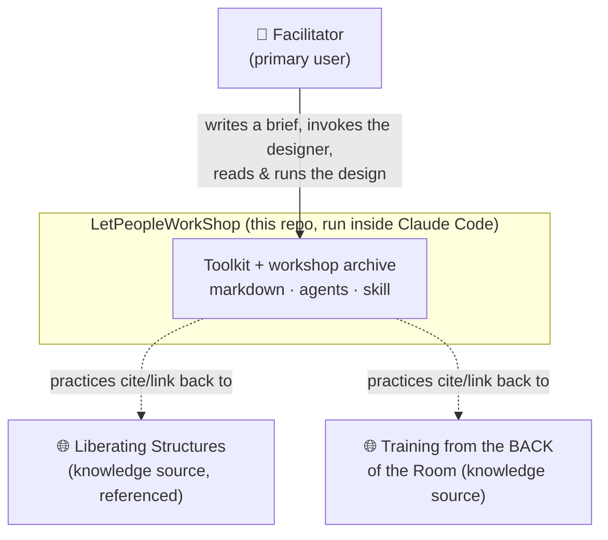
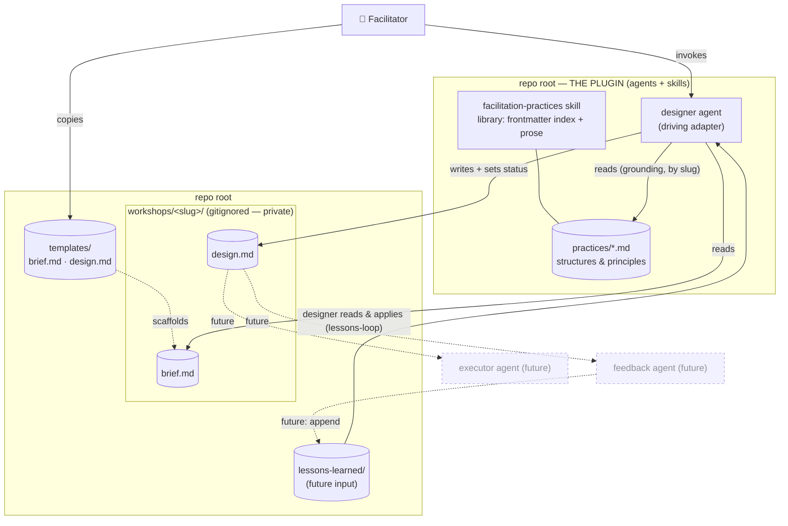
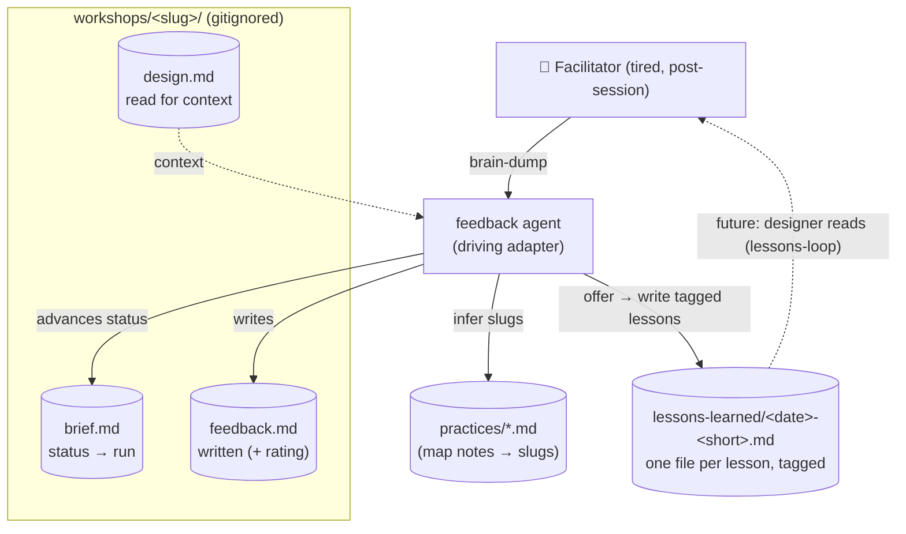
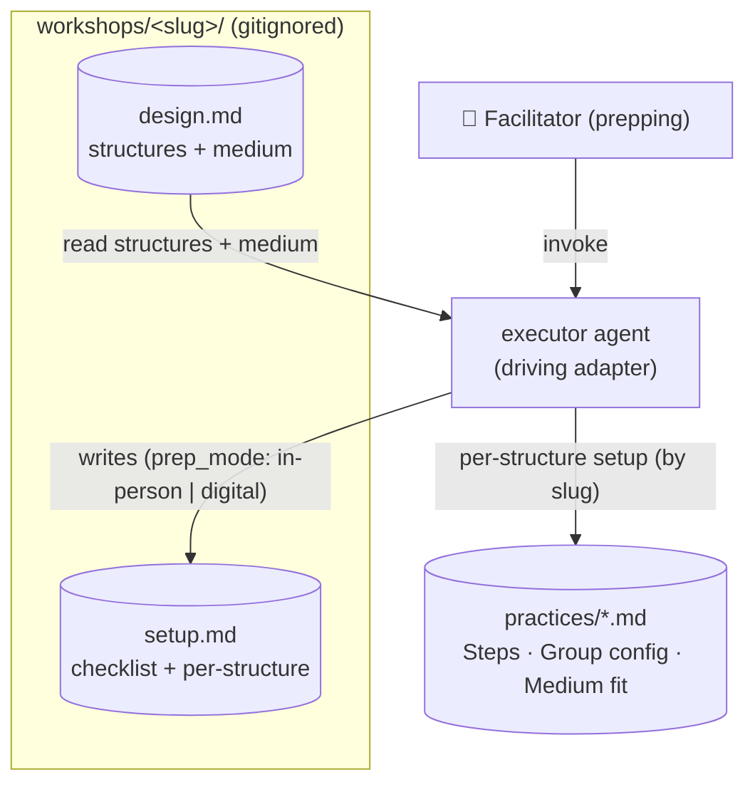

# Architecture Brief — LetPeopleWorkShop

> SSOT for architecture. DESIGN wave (application scope, Morgan / nw-solution-architect).
> Bootstrapped greenfield. Extend this file in future waves; do not recreate.

## Application Architecture

### Style
**Ports-and-adapters (hexagonal), document-oriented.** There is no compiled application and no runtime
service. The "business logic" lives in **agent prompts** (`agents/`) and **skill knowledge**
(`skills/`); the "data" is **markdown + YAML frontmatter** on the filesystem. Agents are
**stateless transformers** that read the *library* (knowledge) and a *workshop folder* (work-in-progress)
and write back into the workshop folder. This keeps the design trivially extensible: new capability = a
new agent file; new facilitation method = a new practice file.

### The one load-bearing decision
**The `workshops/<slug>/` folder is the integration contract between every current and future agent.**
The `designer` writes `design.md`; a future `executor` reads `design.md` and writes `setup.md`; a future
`feedback` agent reads both and writes `feedback.md` / appends to `lessons-learned/`. Agents never call
each other — they compose by reading and writing files in the shared folder. This is the seam that lets
executor/feedback land later without touching the designer (ADR-003).

### Components
| Component | Responsibility | Location | Kind | This wave |
|---|---|---|---|---|
| `designer` agent | brief → grounded, time-reconciled `design.md`; applies past lessons (loop); maintains status lifecycle | `agents/designer.md` | driving adapter | EXTEND (lessons-loop) |
| `facilitation-practices` skill | the library: index (frontmatter) + detail (prose); list/explain/recommend/ground | `skills/facilitation-practices/` | domain knowledge + read port | EXTEND |
| `templates/` | `brief.md` + `design.md` scaffolds (schemas) | `templates/` | contract | EXTEND |
| workshop store | per-session folder: `brief.md`, `design.md` (+ future `setup.md`, `feedback.md`) | `workshops/<slug>/` | driven adapter (filesystem, gitignored) | FORMALIZE |
| `feedback` agent | brain-dump → `feedback.md` (+ rating, status→run); extract tagged lessons | `agents/feedback.md` | driving adapter | BUILT (feedback-capture) |
| lessons store | one file per tagged lesson | `lessons-learned/<date>-<short>.md` | driven adapter (gitignored) | FORMALIZED (feedback-capture) |
| `executor` agent | `design.md` → `setup.md` prep pack (checklist + per-structure), in-person/digital | `agents/executor.md` | driving adapter | BUILT (executor) |

### Ports
- **Driving (inbound):** invoke `designer` (→ `design.md`), `executor` (→ `setup.md`), or `feedback`
  (→ `feedback.md` + lessons), each pointed at a `workshops/<slug>/` folder.
- **Driven (outbound), all filesystem adapters, no network:**
  - read practices library (`skills/facilitation-practices/practices/*.md`)
  - read `workshops/<slug>/brief.md` · read `workshops/<slug>/design.md` (executor + feedback context)
  - write `workshops/<slug>/design.md` (designer) · write `workshops/<slug>/setup.md` (executor) · write `workshops/<slug>/feedback.md` (feedback)
  - write `lessons-learned/<date>-<short>.md` (feedback) · update brief `status` (designer, feedback)
  - read `lessons-learned/*.md` (designer — the learning loop; applies relevant past lessons)

### Contracts (schemas)
- **Practice file** — YAML frontmatter index (`slug`, `name`, `type`, `source`, `source_url`, `mediums`,
  `group_min/max`, `time_min/max`, `tags`) + prose body (`Purpose`, `When to use`, `Group config`,
  `Timing`, `Medium fit`, `Steps`, `Facilitator notes`). `type: principle` omits group/time. See ADR-002.
- **Brief** — frontmatter (`slug`, `status`, `created`, `medium`, `group_size`, `duration_min/max`) +
  prose (convener, goal, audience, constraints/sensitivities).
- **Design** — frontmatter (`slug`, `status`, `designed`, `total_min`, `time_band`, `grounding`,
  `lessons_applied`, `reuse`) + body (goal, design stance, agenda table, time reconciliation, facilitator
  notes, **lessons applied** when relevant, grounding check).
- **Grounding** — every agenda structure cites a practice by **slug**; the slug MUST resolve to a
  `practices/<slug>.md`. Designs cite slugs, never paths, so the library can move into a packaged plugin
  without rewrites (ADR-004).
- **Status lifecycle** — `draft → designed → run → archived` on the brief; the designer advances
  `draft → designed`, the **feedback agent** advances `designed → run`, the facilitator owns `archived`.
  Makes the archive/hub queryable.
- **Feedback** — frontmatter (`slug`, `status: run`, `ran`, `rating` 1-5) + skippable body sections
  (what worked, what didn't, timing planned-vs-actual, energy/surprises, what I'd change). See ADR-005.
- **Lesson** — one file per lesson `lessons-learned/<date>-<short>.md`; frontmatter (`date`, `workshop`
  slug, `practices` [slugs], `themes` [free-form]) + one-line takeaway. Loop-ready (ADR-005).
- **Setup** — frontmatter (`slug`, `prep_mode` in-person|digital, `prepared`, `coverage`) + a tickable
  materials/pre-build checklist + per-structure setup steps grounded in practice notes. Markdown recipe
  only (no Miro API). See ADR-006. Prep is pre-session → does not change brief `status`.

### Technology choices
| Concern | Choice | Rationale |
|---|---|---|
| Data format | Markdown + YAML frontmatter | Human-ownable, diffable, GitHub-native; frontmatter gives a machine index without a database |
| Agents | Claude Code subagents (`agents/`) | The repo *is* the tool (D2); no app to build/host |
| Library capability | Claude Code skill (`skills/`) | Fulfills "extensible practices via skills" (D7); plugin-portable |
| Versioning | git (local now; GitHub remote later) | History + public distribution; private content gitignored (D6) |
| Runtime / language / build | **none** | Document-oriented; nothing to compile or run |
| (Deferred) validator | TBD — a small lint script if grounding/schema needs machine enforcement | Not built now; agent self-checks grounding (open question) |

**Paradigm:** N/A — no code. Document-oriented / declarative. If executable tooling is ever added
(e.g. a citation/schema linter), default to OOP per nWave convention; revisit then. No `CLAUDE.md`
paradigm line written this wave.

### Extensibility & distribution
- **Add a practice:** drop a markdown file in the skill's `practices/` (no code change).
- **Add an agent:** drop a file in `agents/`.
- **Distribute:** the repo **is** the plugin (ADR-007) — `.claude-plugin/plugin.json` at root with
  `agents/` + `skills/` + `templates/` bundled. Install via `/plugin install` (or the community
  marketplace); dev via `claude --plugin-dir .`. Toolkit files are read via `${CLAUDE_PLUGIN_ROOT}`; the
  toolkit has zero dependency on user content under `workshops/`.

## C4 — System Context

## C4 — Container / Component

## Outcome Collision Check
**Skipped — correctly.** This feature is a document/agent toolkit with no typed *code* contract surface;
per the registry's gate-scoping (code-feature pipelines only) it is out of scope, and the
`nwave-ai outcomes` CLI belongs to the nWave framework repo, not this target project. No registry exists
here to collide against.

## C4 — Debrief flow (feedback-capture)

> Agents compose only through the folder (ADR-003): the `feedback` agent never calls the `designer`; it
> reads `design.md` for context and writes `feedback.md` + lessons. The dashed edge is the future loop.

## C4 — Prep flow (executor)

> The executor is a pure read→write transform: `design.md` + practice notes → `setup.md`. It does NOT
> change the brief `status` (prep is pre-session; `feedback` owns the `run` transition). Markdown recipe
> only — the digital pack is a Miro/video build-it-yourself recipe, not a live board (ADR-006).

## Agent triad (composition summary)
Three driving agents, each a stateless transform over the shared `workshops/<slug>/` folder:
`designer` (brief→design) · `executor` (design→setup) · `feedback` (run→feedback + lessons). None call
each other (ADR-003). The **`lessons-loop` closes the cycle**: `designer` reads `lessons-learned/` and
applies relevant past lessons (matched by `practices` slug + `themes`) to new designs, citing them in
`lessons_applied`. The hub now compounds — each debrief makes the next design smarter.
