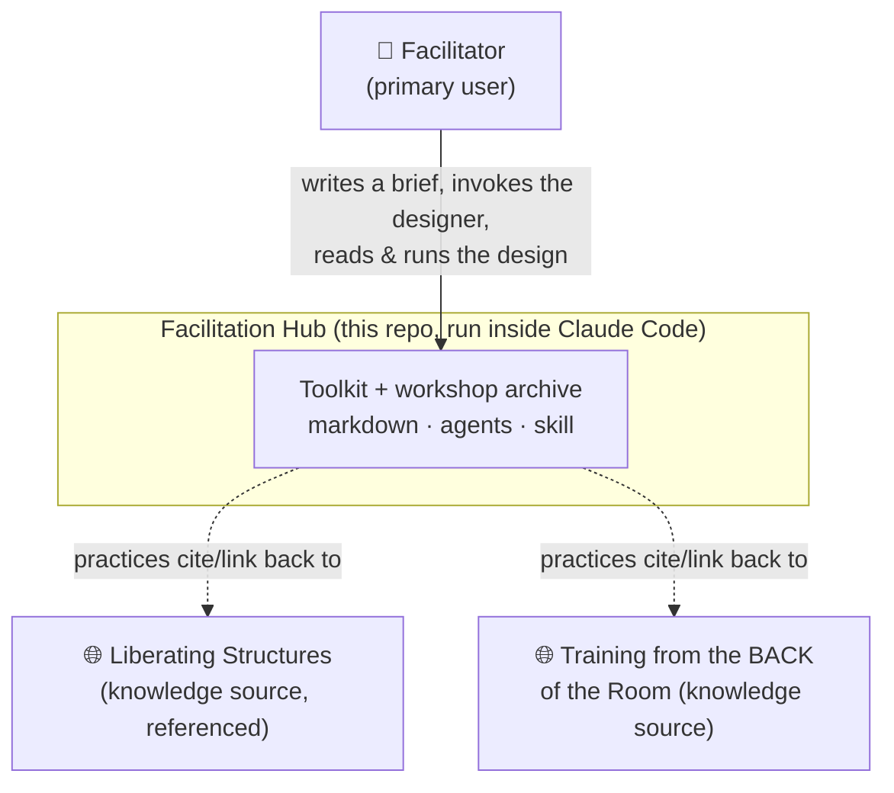
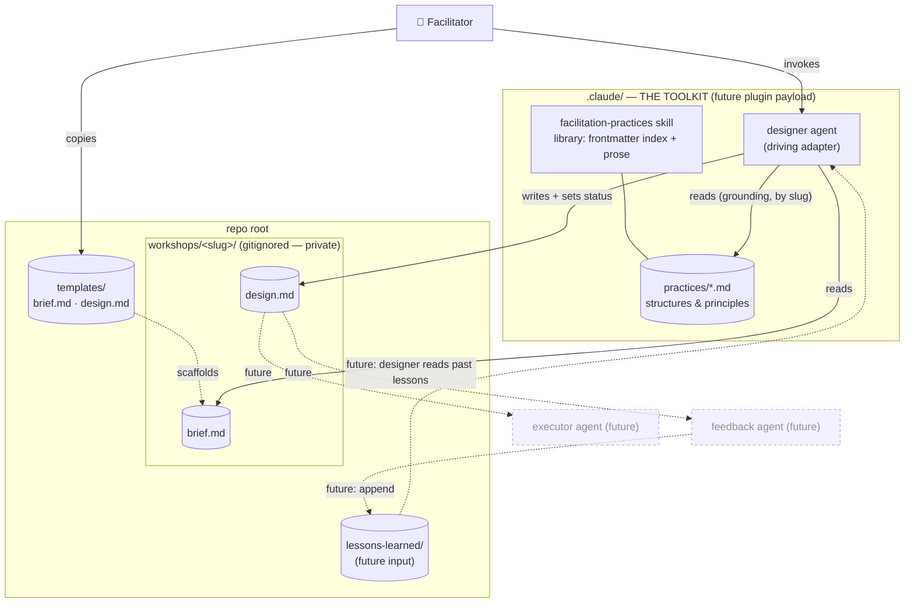

# Architecture Brief — Facilitation Hub

> SSOT for architecture. DESIGN wave (application scope, Morgan / nw-solution-architect).
> Bootstrapped greenfield. Extend this file in future waves; do not recreate.

## Application Architecture

### Style
**Ports-and-adapters (hexagonal), document-oriented.** There is no compiled application and no runtime
service. The "business logic" lives in **agent prompts** (`.claude/agents/`) and **skill knowledge**
(`.claude/skills/`); the "data" is **markdown + YAML frontmatter** on the filesystem. Agents are
**stateless transformers** that read the *library* (knowledge) and a *workshop folder* (work-in-progress)
and write back into the workshop folder. This keeps the design trivially extensible: new capability = a
new agent file; new facilitation method = a new practice file.

### The one load-bearing decision
**The `workshops/<slug>/` folder is the integration contract between every current and future agent.**
The `designer` writes `design.md`; a future `executor` reads `design.md` and writes `setup.md`; a future
`feedback` agent reads both and writes `feedback.md` / appends to `lessons-learned/`. Agents never call
each other — they compose by reading and writing files in the shared folder. This is the seam that lets
executor/feedback land later without touching the designer (ADR-003).

### Components
| Component | Responsibility | Location | Kind | This wave |
|---|---|---|---|---|
| `designer` agent | brief → grounded, time-reconciled `design.md`; maintains status lifecycle | `.claude/agents/designer.md` | driving adapter | EXTEND |
| `facilitation-practices` skill | the library: index (frontmatter) + detail (prose); list/explain/recommend/ground | `.claude/skills/facilitation-practices/` | domain knowledge + read port | EXTEND |
| `templates/` | `brief.md` + `design.md` scaffolds (schemas) | `templates/` | contract | EXTEND |
| workshop store | per-session folder: `brief.md`, `design.md` (+ future `setup.md`, `feedback.md`) | `workshops/<slug>/` | driven adapter (filesystem, gitignored) | FORMALIZE |
| lessons store | aggregated reusable lessons | `lessons-learned/` | driven adapter (gitignored) | placeholder |
| `executor`, `feedback` agents | prep pack / debrief over the same folder | future `.claude/agents/` | boundary only | NOT BUILT |

### Ports
- **Driving (inbound):** invoke the `designer` subagent inside Claude Code, pointed at a `brief.md`.
  (Future: `executor`, `feedback` — same pattern.)
- **Driven (outbound), all filesystem adapters, no network:**
  - read practices library (`.claude/skills/facilitation-practices/practices/*.md`)
  - read `workshops/<slug>/brief.md`
  - write `workshops/<slug>/design.md`
  - read `lessons-learned/*.md` *(future — lessons-loop feature)*

### Contracts (schemas)
- **Practice file** — YAML frontmatter index (`slug`, `name`, `type`, `source`, `source_url`, `mediums`,
  `group_min/max`, `time_min/max`, `tags`) + prose body (`Purpose`, `When to use`, `Group config`,
  `Timing`, `Medium fit`, `Steps`, `Facilitator notes`). `type: principle` omits group/time. See ADR-002.
- **Brief** — frontmatter (`slug`, `status`, `created`, `medium`, `group_size`, `duration_min/max`) +
  prose (convener, goal, audience, constraints/sensitivities).
- **Design** — frontmatter (`slug`, `status`, `designed`, `total_min`, `time_band`, `grounding`, `reuse`)
  + body (goal, design stance, agenda table, time reconciliation, facilitator notes, grounding check).
- **Grounding** — every agenda structure cites a practice by **slug**; the slug MUST resolve to a
  `practices/<slug>.md`. Designs cite slugs, never paths, so the library can move into a packaged plugin
  without rewrites (ADR-004).
- **Status lifecycle** — `draft → designed → run → archived` on the brief; the designer advances `draft`
  → `designed`, the facilitator owns `run`/`archived`. Makes the archive/hub queryable.

### Technology choices
| Concern | Choice | Rationale |
|---|---|---|
| Data format | Markdown + YAML frontmatter | Human-ownable, diffable, GitHub-native; frontmatter gives a machine index without a database |
| Agents | Claude Code subagents (`.claude/agents/`) | The repo *is* the tool (D2); no app to build/host |
| Library capability | Claude Code skill (`.claude/skills/`) | Fulfills "extensible practices via skills" (D7); plugin-portable |
| Versioning | git (local now; GitHub remote later) | History + public distribution; private content gitignored (D6) |
| Runtime / language / build | **none** | Document-oriented; nothing to compile or run |
| (Deferred) validator | TBD — a small lint script if grounding/schema needs machine enforcement | Not built now; agent self-checks grounding (open question) |

**Paradigm:** N/A — no code. Document-oriented / declarative. If executable tooling is ever added
(e.g. a citation/schema linter), default to OOP per nWave convention; revisit then. No `CLAUDE.md`
paradigm line written this wave.

### Extensibility & distribution
- **Add a practice:** drop a markdown file in the skill's `practices/` (no code change).
- **Add an agent:** drop a file in `.claude/agents/`.
- **Distribute:** fork the repo today; later wrap `.claude/` in `.claude-plugin/plugin.json` and publish
  to a marketplace (ADR-001). The whole toolkit is the self-contained `.claude/` subtree, with zero
  dependency on user content under `workshops/`.

## C4 — System Context

## C4 — Container / Component

## Outcome Collision Check
**Skipped — correctly.** This feature is a document/agent toolkit with no typed *code* contract surface;
per the registry's gate-scoping (code-feature pipelines only) it is out of scope, and the
`nwave-ai outcomes` CLI belongs to the nWave framework repo, not this target project. No registry exists
here to collide against.
